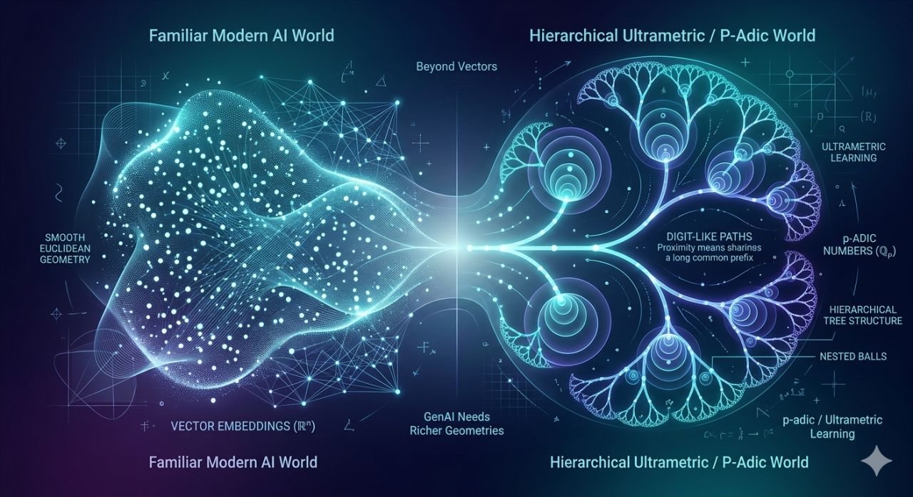

# padic-ds · v0.1.1

[](https://pypi.org/project/padic-ds/)
[](LICENSE)


<p align="center">
  
</p>

A **p-adic** foundation for data science — finite-precision arithmetic over **ℚ_p**
(truncated to `ctx.prec` significant base-p digits), ultrametric geometry,
Hensel lifting, and sklearn-compatible learners.

---

## Why p-adics for data science?

The p-adic metric is an *ultrametric*: every triangle is isosceles
(d(x,z) ≤ max{d(x,y), d(y,z)}), balls are both open and closed, and any
two balls are either disjoint or nested.  This structure:

- Can represent **certain rooted hierarchies naturally** when the encoding
  is chosen appropriately (contrast: generic Euclidean tree embeddings
  incur Ω(√log n) distortion).
- **May reduce concentration pathologies**: in high-dimensional ℝ^n
  nearest/farthest distances converge; ultrametric distances can be
  better separated, though they introduce distance ties and
  precision-dependent degeneracies.
- Provides a **canonical multi-scale decomposition** via p-adic balls — a
  natural analogue of wavelets for hierarchical data.

See [`docs/whitepaper.md`](docs/whitepaper.md) for a full technical discussion.

---

## Install

```bash
pip install -e .                    # core (numpy + scikit-learn)
pip install -e ".[viz]"             # + matplotlib
pip install -e ".[dev]"             # + pytest, ruff, mypy, hypothesis
pip install -e ".[notebook]"        # + jupyter, jupytext
```

Or with conda/mamba:

```bash
conda env create -f environment.yml
conda activate padic-ds
```

**Python ≥ 3.9 required.**

---

## TL;DR math

Every nonzero x ∈ ℚ_p can be written **uniquely** as x = p^v · u where:
- **v = v_p(x) ∈ ℤ** is the *p-adic valuation* (can be negative for fractions),
- **u ∈ ℤ_p×** is a *unit* (gcd(u, p) = 1).

The **p-adic absolute value** is |x|_p = p^{−v}, inducing the ultrametric
d_p(x, y) = |x − y|_p with the strong triangle inequality.

**Balls** B(a, p^{−n}) are clopen (both open and closed); any two are
disjoint or nested — a perfect hierarchical cover.

**Hensel's lemma**: if f(a₀) ≡ 0 (mod p) and f′(a₀) ≢ 0 (mod p), then a₀
lifts uniquely to a root in ℤ_p.  Current implementation is linear lifting
(precision +1 per step); quadratic (Newton–Hensel) is on the roadmap.

---

## Core API

```python
from padic import QpContext, Qp, QpBall, hensel_lift_simple
from padic import BTRootedTree, bt_distance, bt_distance_full
from padic import lca_depth, digits_p_adic, digits_with_valuation
from padic import padic_abs, padic_dist, pairwise_padic_dist
from padic import PadicKNNClassifier, embed_float_array, ultrametric_dendrogram
```

---

## Quickstart

### Qp arithmetic

```python
from padic import QpContext, Qp, padic_dist

ctx = QpContext(p=5, prec=8)          # 5-adics, 8 significant digits
x = Qp.from_rational(ctx, 7, 12)     # 7/12 in ℚ_5
y = Qp.from_int(ctx, 10)             # 10 in ℚ_5

print(x.val())                        # v_5(7/12) = 0
print(padic_dist(x, y))               # |7/12 - 10|_5
```

### Balls and refinement

```python
from padic import QpContext, Qp, QpBall

ctx = QpContext(p=3, prec=6)
center = Qp.from_int(ctx, 4)
B = QpBall(center, n=2)              # B(4, 3^{-2})
assert B.contains(Qp.from_int(ctx, 13))  # 13 ≡ 4 (mod 9)

children = B.refine()                # 3 disjoint sub-balls of radius 3^{-3}
assert len(children) == 3
```

### Hensel lifting

```python
from padic import QpContext, hensel_lift_simple

ctx = QpContext(5, prec=8)
# f(x) = x^2 - 6 over ℤ_5; a0=1 since 1 - 6 = -5 ≡ 0 (mod 5)
root = hensel_lift_simple(
    ctx,
    fZ=lambda t: t * t - 6,
    fZprime=lambda t: 2 * t,
    a0_mod_p=1,
    target_prec=8,
)
check = root.mul(root).sub(Qp.from_int(ctx, 6))
assert check.is_zero() or check.val() >= ctx.prec
```

### Pairwise distance matrix

```python
from padic import QpContext, Qp, pairwise_padic_dist

ctx = QpContext(3, prec=6)
pts = [Qp.from_int(ctx, k) for k in [1, 3, 9, 27]]
D = pairwise_padic_dist(pts)    # 4×4 numpy array
```

### BT tree distances

```python
from padic import QpContext, Qp, bt_distance, bt_distance_full

ctx = QpContext(5, prec=6)
x = Qp.from_int(ctx, 3)
px = Qp.from_int(ctx, 15)          # 3 × 5

# Unit-only surrogate (ignores valuation — documented limitation):
print(bt_distance(ctx, x, px))      # 0 (same unit digits)

# Valuation-aware variant:
print(bt_distance_full(ctx, x, px)) # > 0 (different valuation)
```

### Ultrametric kNN

```python
from padic import QpContext, Qp, PadicKNNClassifier
import numpy as np

ctx = QpContext(3, prec=6)
X = [[Qp.from_int(ctx, n)] for n in [1, 4, 10, 13, 40, 121]]
y = np.array([0, 0, 0, 1, 1, 1])

clf = PadicKNNClassifier(ctx, k=3).fit(X, y)
print(clf.predict(X))
print(clf.predict_proba(X))
```

---

## Notebooks

| Notebook | Open in Colab | Description |
|----------|---------------|-------------|
| `notebooks/00_tutorial.ipynb` | [](https://colab.research.google.com/github/Mircus/padics/blob/master/notebooks/00_tutorial.ipynb) | **Complete tutorial** — arithmetic, balls, Hensel lifting, clustering, kNN, visualisations |
| `notebooks/03_padic_basics.ipynb` | [](https://colab.research.google.com/github/Mircus/padics/blob/master/notebooks/03_padic_basics.ipynb) | Qp arithmetic, balls, Hensel lifting |
| `notebooks/04_ultrametric_ml.ipynb` | [](https://colab.research.google.com/github/Mircus/padics/blob/master/notebooks/04_ultrametric_ml.ipynb) | Dendrograms, distance heatmap, p-adic kNN |

---

## API status

| Component | Status |
|-----------|--------|
| `Qp` arithmetic (add, sub, mul, inv, div) | ✅ Implemented |
| `QpBall` (contains, intersect, refine) | ✅ Implemented |
| Hensel lifting (linear) | ✅ Implemented |
| BT tree distance (unit-only) | ✅ Implemented |
| BT tree distance (valuation-aware) | ✅ Implemented |
| Pairwise distance matrices | ✅ Implemented |
| kNN classifier (predict, predict_proba) | ✅ Implemented |
| Ultrametric dendrogram | ✅ Implemented |
| Ball-tree index for ANN | 🗺 Roadmap |
| Real → Qp^d embedding module | 🗺 Roadmap |
| Quadratic Newton–Hensel lifting | 🗺 Roadmap |
| p-adic wavelets | 🔬 Research prospect |
| Group-equivariant learning on BT | 🔬 Research prospect |

---

## Precision semantics

> **This is a bounded fixed-window model, not a full relative-precision
> p-adic floating-point system.**  Every element is stored with exactly
> `ctx.prec` significant base-p digits — there is no per-element precision
> tracking and no lazy/exact arithmetic.  Results are always truncated to the
> global window; information lost at the low end is irrecoverable.

Key conventions:

- `v_p(0) = +∞` represented by the sentinel `10**9`.
- `Qp.from_int(ctx, n)` raises `PrecisionError` if `v_p(n) ≥ ctx.prec`
  (all significant digits would be lost).
- Addition truncates naturally; information lost at the low end is irrecoverable.
- The BT unit-only distance (`bt_distance`) ignores valuation by design:
  `bt_distance(x, p·x) == 0`.  Use `bt_distance_full` to account for valuation.
- `QpBall.refine()` is only defined for `n < ctx.prec`; calling it when
  `n >= ctx.prec` raises `ValueError` (refinement would collapse all children
  to the same center under truncation).

---

## References

1. Serre, J.-P. (1980). *Trees*. Springer.
2. Robert, A. M. (2000). *A Course in p-adic Analysis*. Springer GTM 198.
3. Khrennikov, A. (1994). *p-Adic Valued Distributions in Mathematical Physics*. Kluwer.
4. Matousek, J. (2002). *Lectures on Discrete Geometry*. Springer (tree embedding bounds).
5. Murtagh, F. (2004). On ultrametric algorithmic information. *Computer Journal* 47(4).
6. Dress, A. (1984). Trees, tight extensions of metric spaces. *Advances in Mathematics* 53(3).

---

## Roadmap

- Efficient **ball-tree index** for exact p-adic ANN retrieval.
- **PadicEmbed**: real ℝ^d → ℚ_p^d transformer for sklearn pipelines.
- **Quadratic Hensel lifting** (Newton–Hensel, modulus doubling).
- Tree kernels and Gaussian processes on the BT tree.
- MkDocs documentation site with API reference.

---

## Contributors

| Name | Role | GitHub |
|------|------|--------|
| [Mirco A. Mannucci](https://github.com/Mircus) | Creator & Lead Developer | [@Mircus](https://github.com/Mircus) |

---

MIT License · [HoloMathics](https://github.com/Mircus) / Mirco A. Mannucci
